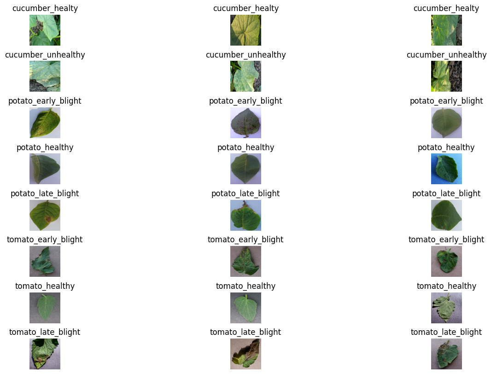
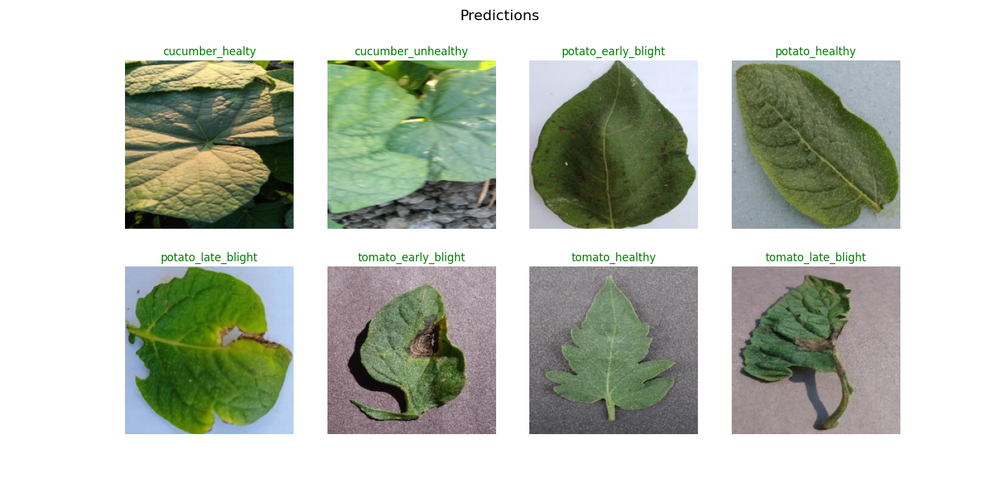

# Plant Disease Classification
## Overview

Agriculture plays a vital role in ensuring food security and sustaining global economies. However, the agricultural sector faces a persistent threat in the form of plant diseases that can lead to significant crop losses. The urgency of developing an effective plant disease classification system stems from the following critical factors:

1. Early detection and intervention are crucial to prevent widespread crop damage and mitigate economic losses.

2. Detecting and managing plant diseases promptly contributes to sustainable farming by reducing the need for excessive pesticide use and minimizing environmental impact.


3. Advancements in technology, particularly in the field of deep learning and computer vision, provide us with the tools to revolutionize disease detection processes

## Dataset



The dataset used is a collection of leaf photos from several plants such as cucumber, tomato, and potato. The dataset consists of a total of 4000 photos divided into 8 classes, where each class has 500 photo data. These classes encompass both healthy and unhealthy conditions for cucumber, tomato, and potato plants, such as unhealthy cucumber, healthy cucumber, healthy potato, early blight potato, late blight potato, healthy tomato, early blight tomato, and late blight tomato.

Link Dataset: https://drive.google.com/drive/folders/1NQHZZBc3WHxCIZyiIsqumUbJIXKEMa3p?usp=drive_link

## Pre-requisite Packages
- **Python** : You need to install Python 3.9 or later
- **IDE**    : You need to install an IDE to run the program, I recommend you to install VS Code
- **Library**: To run this program you need to install requirements.txt.

## Installation

1.  Clone this repository to your local device using `git`:
    ```
    git clone https://github.com/widyamsib/plant-disease-classification.git
    ```
2.  Change your terminal into the new subdirectory:
    ```
    cd plant-disease-classification
    ```
3.  Then open in Visual Studio Code:
    ```
    code .
    ```
4.  If the Python requires a virtual environment, create and activate the virtual environment in the terminal
    ```
    python -m venv venv
    .\venv\Scripts\activate
    ```
5.  Install project depedencies using:
    ```
    pip install -r requirements.txt
    ```

## Prediction

